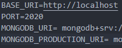

# Hour Logger Application
Node.JS powered hour logger application


## Accessing the Application

The Application can be accessed [HERE](https://hour-logger-app.herokuapp.com/).
It is hosted on [Heroku](https://www.heroku.com)

## Technologies Used

- NodeJS
- Mongoose
- MongoDB
- Express
- Express Session
- ejs
- dotenv
- nodemon

## Getting Started - Dev

- Clone the repo
- Install the dependencies -  `npm install`
- You'll Have to create a ".env" file and store your database string there for use
```
 MONGODB_URI= < MONGODB DATABASE STRING >
```
- 
- Run the project in development mode - `npm run dev`

## Getting Started - Production

- As a user to the application you may access it through the link provided.
- [Hour Logger Application](https://hour-logger-app.herokuapp.com/)
- You may use this application as you wish.
- If any issues are found please post them on Github.

