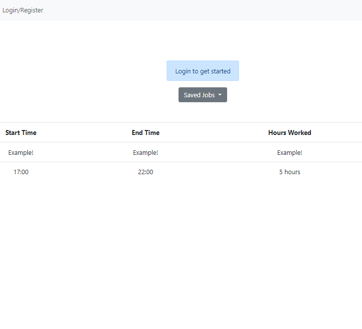
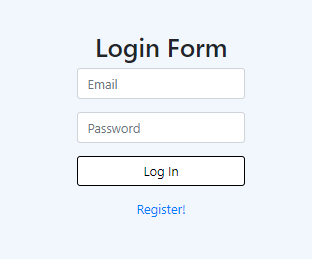
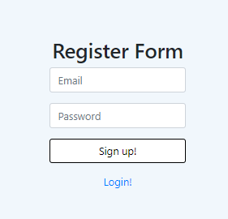
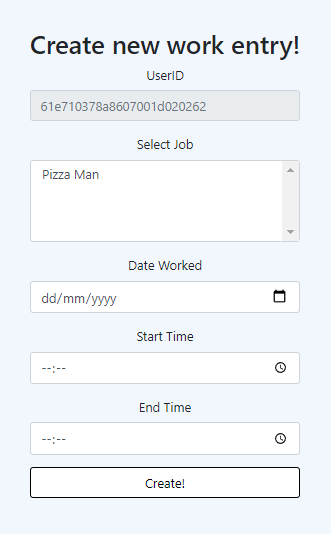
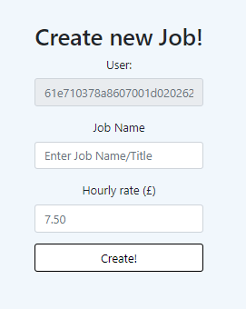
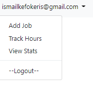
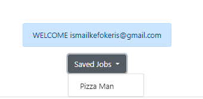
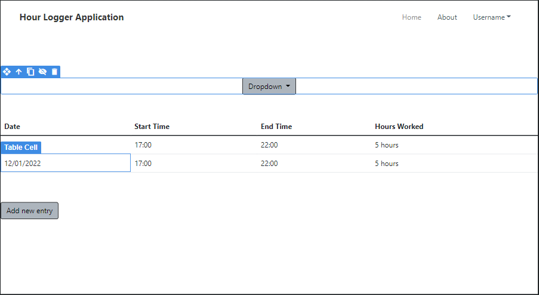

# COM519 Assignment
## Hour Logger Application
### [Hosted Application - Heroku](https://www.heroku.com)
### [Github repository](https://github.com/IsmailKefokeris/HourLoggerApplication)


## Introduction
I have been tasked to create, test, and deploy, a proof of concept data-driven full stack web-application. I was handed
the option to either make sense of existing data or solve a problem in my work or social life. I have chosen the latter. I will
be creating and designing a time logging app which will allow individual users to sign in and log hours worked from their job 
(indipendently from the company). The application must also have CRUD implemented to show my understanding.

I am desiging and creating this because of a problem I ran into recently, I was paid after a month of work at a new job, I wasnt sure if the amount that was handed to me was correct. To double check I had to painstakingly count back all the days worked and tally the hours for each day. Finally I found that I was underpaid and had to relay the amount owed to my manager. If there were a tool I had access to that could have prevented this situation or, at least made it easier to tally, much of my time could have been saved.

## System Overview

__The System contains the following features:__
   - Allows the user to register.
   - Allows the user to Login, saving their data.
   - Calculates amount earned daily, weekly, and monthly.
   - Allows the user to input/edit/update/delete the day they worked. (Tracker Object)
   - Allows the user to add/edit/update/delete multiple Jobs to their account. (Job Object)

__Completed Features__

- [x] Registering new account
- [x] Ability to Login to account
- [x] Create a new Job
- [x] Create a tracker object linked to a Job & User account
- [x] Modify Tracker object
- [ ] Modify Job object
- [ ] Modify User object
- [ ] View User Stats (income all time, weekly, monthly)

The System will present the user with the home page showing an example of what the page will look like after you fill out your details
and sign in. Before the user is able to interact with the website they must first sign in, doing so will give them more options such as 
adding a new Job entry.<br>


When the user attempts to sign in they will be greeted with a login page.<br>
 

If they never had an account before they will also be able to register<br>
using the register page.<br>


The User will after logging in have a drop down menu of options from which they can create a new Job or Tracker OR view stats.<br>


 

The Home page will also be updated with information for the user to go through. <br>
 


## Key Design Decisions

Initial Design for application, designed on bootstrap studio 5.

When designing the the Hour Logger Application I made note of the mandatory requirements (use of CRUD).
Aesthetically I decided to go with a very simple look as the app itself is a simple minimalistic app.


### Database Design

The Database will contain three collections:
   - User: Stores User Data
   - Tracker: Stores tracking data for each day worked
   - Job: Stores Data from the Job worked

This is a Non-Relational database otherwise known as a NoSQL database.
#### __User Object__
The User Object will contain  information from users who have registered on the website.

__Model:__
   ```js
   const userSchema = new Schema(
      {
         email: {
               type: String,
               required: [ true, "Email is required" ],
               unique: true},
         password: {
               type: String,
               required: [ true, "Password is required" ]}
      },
      {
         timestamps: true
      }
   );
   ```
The User Object will store The Email and Password of the user. For security reasons the password will not be stored plain but will go through
a hashing process using "bcrypt"
   ```js
   const hash = await bcrypt.hash(this.password, 10);
   ```
#### __Job Object__
The Job Object will contain information about the jobs that have been added to the website.

__Model:__
   ```js
   const jobSchema = new Schema(
      {
        name: {type: String, required: [true, "Job Title/Name Required"]},
        rate: {type: Number, required: [true, "Job Hourly Rate Required"]},
        user: {type: String, required: true}
      },
      { timestamps: true }
   );
   ```


#### __Tracker Object__
The Tracker object will contain information about the time worked and what job it belongs to.

__Model:__
   ```js
   const trackerSchema = new Schema(
      {
         date: {type: String, required: [true, "Date Required"]},
         startTime: {type: String, required: [true, "Start Time Required"]},
         endTime: {type: String, required: [true, "End Time Required"]},
         totalHours: {type: Number},
         job: {type: String, required: [true, "Job Required"]},
         user: {type: String, required: true}
      },
      { timestamps: true }
   );
   ```

### Security and Scalability

One import section of the application is security. My application allows users to create new accounts and login which means the use of passwords. These passwords should not be stored in plain text but instead hashed then take the hashed versions and store it in the database.
This prevents their passwords from getting leaked to developers and prevents hackers from retrieving their passwords if they managed to break into the database. Additionally to ensure the hash function is not easily cracked I avoided some more known functions (MD5) and used a technique called "salting", which is incorporated by default in the hash function "bcrypt". Bcrypr is a slow function which makes it resistent to brute force attacks and can adapt allowing me as the developer to increase or decrease the speed of the function giving me as much control as possible.

The application is being hosted on Heroku. Heroku is a cloud platform service which allows us to deploy our data-driven application (while keeping in mind the agile manifesto) securely and with a scalable and serverless infrastructure. By using Heroku we can be confident that our application is scalable and with the serverless infrastructure we are provided with many benefits such as no risk to your cost by over-provisioning, no risk to performance, ability to scale your servers without the need to actually scale. Aditionally the application is connected to the Database through a config file (.env) which users wont be able to access keeping the database connection safe and secure.

Another element added to the application was the ability to allow users to still use the application if they wished to disable Javascript, this isnt working at the moment but to implement it would be much more than whats done. Currently I have both AJAX and serverside Javascript versions of viewing the Job Trackers implemented so in theory I could detect whether Javascript is enabled or not and use either version.


## Conclusion and Reflection

In conclusion, COM519 Assignment - Hour Logger Application has completed all the mandatory requirements (CRUD). The application has implemented 
a few industry standard components such as, not storing plain text passwords, avoiding client side validation (HTML) and instead have database and server side validation, using serverless infrastructure allowing for scalability. There are parts which I would need to work on implementing AJAX in more places around the application to make the website more dynamic and less static and clunky. Working a little more on the front end wouldnt hurt as it is plain and unappealing.

My project files are disorganised- upon reflection, I have determined that the management of my files in future should be less haphazard. This may be a point to research after the project.

For the future I would like to continue developing this project, making it more stable and functional. I would like to implement the missing functions such as seeing total earnings for all time, week, and month. Additionally I would like to make the application look more appealing and have the ability to adjust depending on what kind of screen size is being used to access it.
### Issues Encountered

__Issue 1:__ Updating Database Object, I ran into some issues when attempting to update the Tracker Database object using the findByIDandUpdate() function. I am still unsure why it wasn't able to find my object through the ID but I got my updating function working by using findOneAndUpdate()
instead and just passing the Object to find it.

__Issue 2:__ Calculating the total amount of hours worked. This was an issue I was stuck on for a little while as I couldnt figure out how to calculate the hours inbetween two time periods for a 24 hour clock effectively. Even with my current solution of converting the time it into a dateTime object, getting the hours, then deducting the endTime from the Start there are still a few issues, for instance it will only calculate in whole hours so you wont have double variables. 

__Issue 3:__ Negative numbers would be returned to me when calculating the difference sometimes, this was likely due to the ending time being a larger number than the starting time, to fix this I simply multiplied the difference by -1.

__Issue 4:__ Updating total earnings on the view stats page. I was unable to update the total earnings in time for the submit, if I were to attempt it again I know I would need to use aggregation to multiply the rates and the total hours stored in the database.

For most issues I was able to find solutions on websites such as stackoverflow, MongoDB Documentation, Mongoose Documentation, and other documentation for the technologies used.